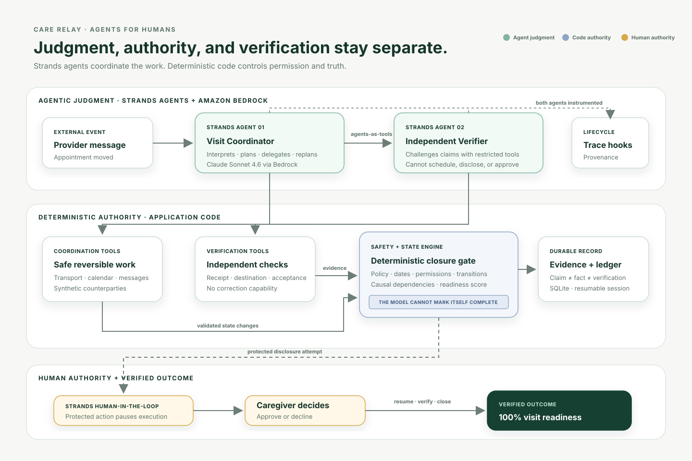
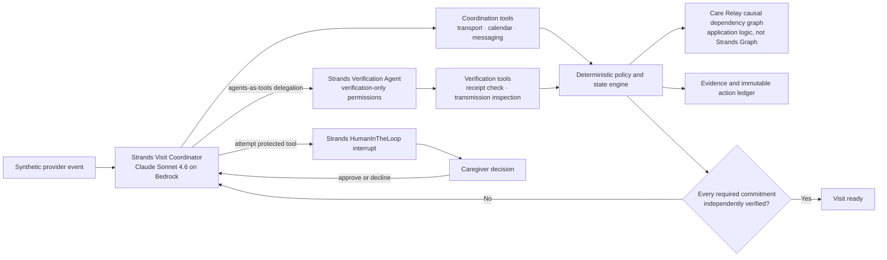

# Care Relay architecture

Care Relay deliberately separates judgment, authority, and state validity. Strands
Agents decides what work to attempt and when to delegate it. Deterministic application
code decides whether dates, permissions, evidence, and state transitions are valid.

## Authority boundaries

| Concern | Authority |
|---|---|
| Interpret an external administrative message | Coordinator Agent |
| Decide which administrative tool to attempt | Coordinator Agent |
| Challenge a completion claim | Verification Agent |
| Decide whether disclosure requires approval | Deterministic policy |
| Enforce the pause before a protected tool | Strands HumanInTheLoop |
| Approve or decline the protected action | Human caregiver |
| Validate state transitions and readiness | Deterministic engine |

## Why two agents

The Verification Agent is not a second persona with equivalent access. It cannot
contact family members, schedule follow-ups, request approval, or send corrections.
Its restricted tool boundary lets it challenge the Coordinator's evidence without
quietly repairing the condition it is supposed to verify.

## Claims are not outcomes

The evidence model distinguishes `claim`, `fact`, and `verification`. A transmission
receipt proves that something was sent, not that the required recipient accepted it.
The deterministic closure gate therefore keeps a case below 100% until every required
commitment has independent verification.
